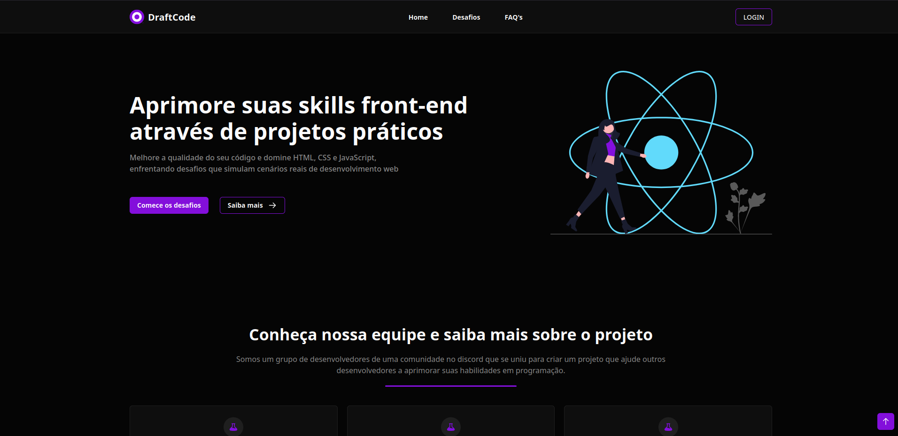

# DraftCode



### Ajustes e melhorias

O projeto ainda está em desenvolvimento e as próximas atualizações serão voltadas nas seguintes tarefas:

- [x] Área para administradores adicionarem suas redes sociais para ficar em evidência no site
- [ ] Melhorar performance.
- [ ] Melhorar responsividade.
- [ ] Corrigir bugs existentes.

## 💻 Pré-requisitos

Antes de começar, verifique se você atendeu aos seguintes requisitos:

- Você tem `docker` instalado.
- Você tem a versão mais recente do `node` e `npm` instalado.
- Você configurou suas váriaveis de ambiente conforme está presente no `.env.example`.

## 🚀 Instalando o DraftCode

Para instalar o DraftCode, siga estas etapas:

Linux:

```
npm install && sudo docker-compose up -d && npx prisma db push && npm run dev
```

Windows:

```
npm install && docker-compose up -d && npx prisma db push && npm run dev
```

## 📫 Contribuindo para o DraftCode

Para contribuir com o DraftCode, siga estas etapas:

1. Faça um fork desse projeto e clone pra você.
2. Crie uma branch: `git checkout -b <nome_branch>`.
3. Faça suas alterações e confirme-as: `git commit -m '<mensagem_commit>'`
4. Envie para o branch original: `git push origin <nome_do_projeto> / <local>`
5. Crie a solicitação de pull.

Como alternativa, consulte a documentação do GitHub em [como criar uma solicitação pull](https://help.github.com/en/github/collaborating-with-issues-and-pull-requests/creating-a-pull-request).

## 🤝 Colaboradores

Agradecemos às seguintes pessoas que contribuíram para este projeto:

<table>
  <tr>
    <td align="center">
      <a href="https://github.com/matheuspergoli" target="_blank">
        <br>
        <sub>
          <b>Matheus Pergoli</b>
        </sub>
      </a>
    </td>
		<td align="center">
      <a href="https://github.com/NatanCastro" target="_blank">
        <br>
        <sub>
          <b>Natan Castro</b>
        </sub>
      </a>
    </td>
  </tr>
</table>

## 📝 Licença

Esse projeto está sob licença. Veja o arquivo [LICENÇA](LICENSE) para mais detalhes.

[⬆ Voltar ao topo](#DraftCode)<br>
