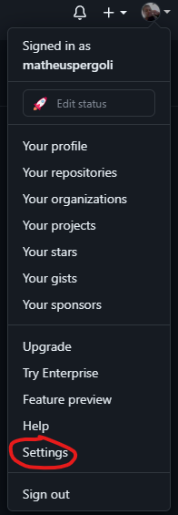
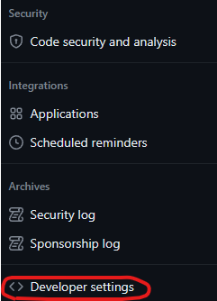
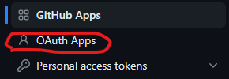
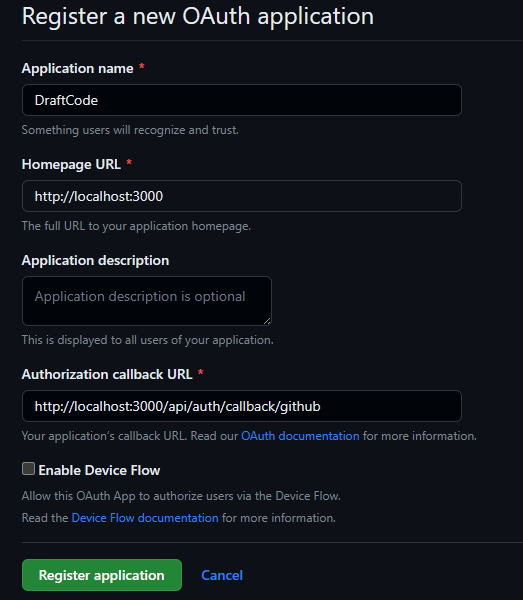

# Como criar um oauth app no github

1. Acesse sua homepage no github e clique na sua foto de perfil no canto superior direito da tela.

2. Clique em `Settings`.



3. Desça a página até a seção `Developer settings`



4. Clique em `OAuth Apps`



5. Clique em `New OAuth App`


6. Preencha os campos conforme a imagem abaixo:



É importante que você preencha o campo `Authorization callback URL` com o endereço do seu servidor de desenvolvimento, no caso, `http://localhost:3000/api/auth/callback/github`

7. Clique em `Register application` e pronto, você já tem seu oauth app criado, agora é só copiar o `Client ID` e o `Client Secret` e colocar no seu `.env` conforme o exemplo abaixo:

```
GITHUB_CLIENT_ID=seu_client_id
GITHUB_CLIENT_SECRET=seu_client_secret
```
